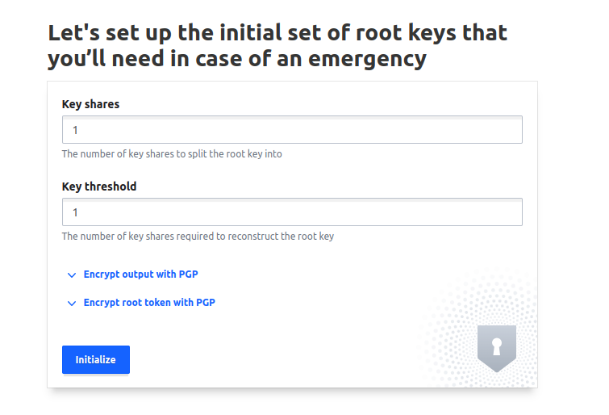
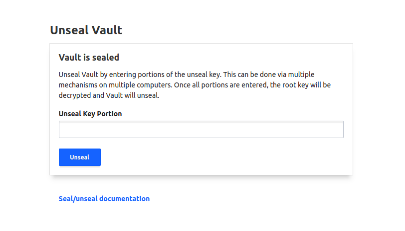
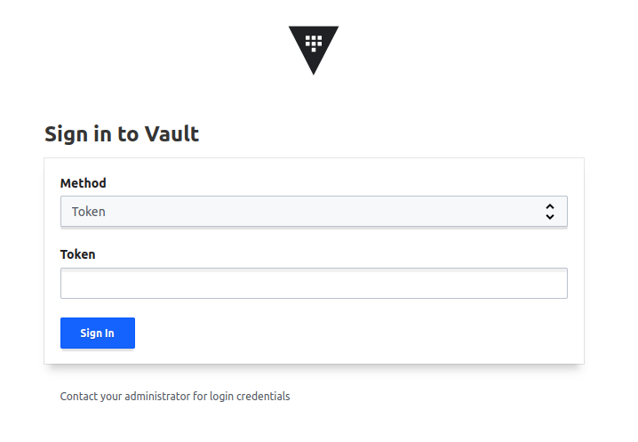

# Vault

## Start and initialize vault from script

Run script `start-and-init.sh` to start and initialize the Vault.

```shell
./start-and-init.sh
```

## Start and initialize vault from UI

Run script `start.sh` to start the Vault.
```shell
./start.sh
```

### Initialize vault
Visit http://localhost:8200/ui and type `1` for `Key shares` and `Key threshold`.



Click on `Initialize` button to create a key and root token.

### Copy and save key and root token

On next screen, copy and save `ìnitial root token` and `Key 1` values for future usage.


Click on `Continue to unseal` button.


## Access Vault from UI

### Unseal Vault

Type saved `Key` and click on Unseal to unseal Vault



### Sign In

Select `Token` as Method, type the `Root token` and click on `Sign In` button to access the Vault.


